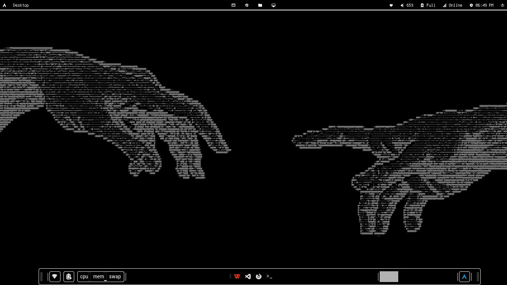

# Minimalistic-White-and-Black-XFCE
This is my minimalistic black and white Adam dotfiles for XFCE.

## Preview

---

## Polybar/Fastfetch/GTK-3.0 theme
- [fastfetch](https://github.com/LierB/fastfetch) - use the **hypr** ones
- [polybar](https://github.com/adi1090x/polybar-themes) - use the **hack** ones
- [BlackAndWhite](https://www.pling.com/p/2010116/) - Download this theme first

---

## NOTE/WARNING
- This is used in XFCE. If you're in a different DE, ignore the gtk.css file.
- Enable hidden directory/files first when enetering the dotfiles directory
- If anything breaks. Goodluck, I ain't helping that (Sorry)

---

# THANK YOU!
